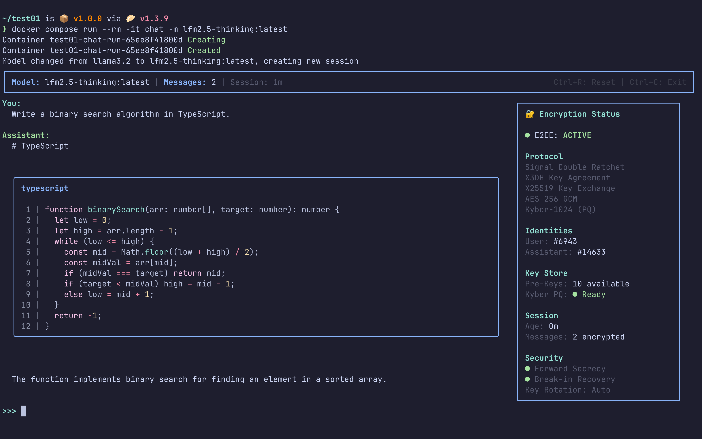
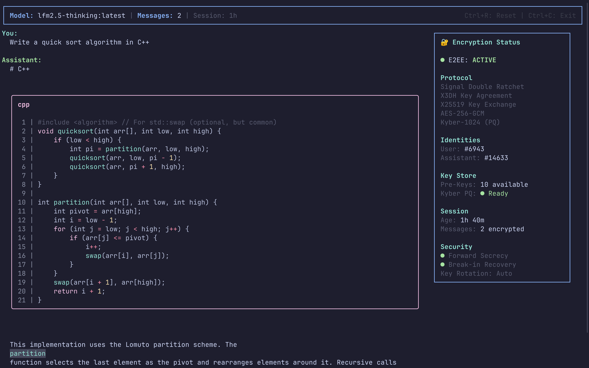
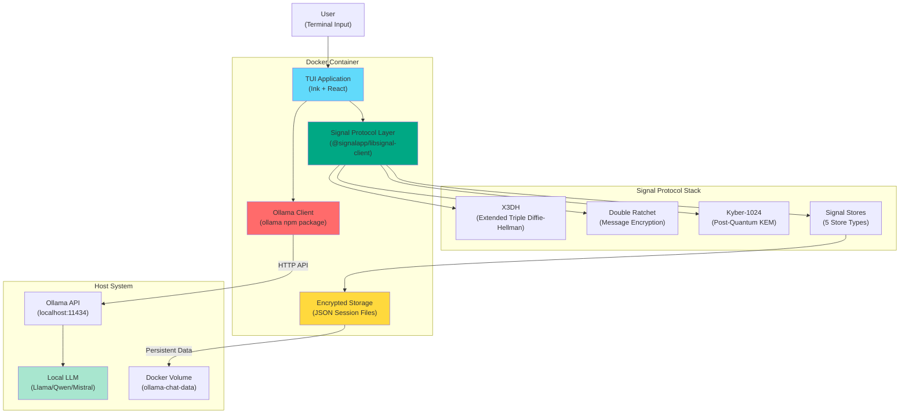
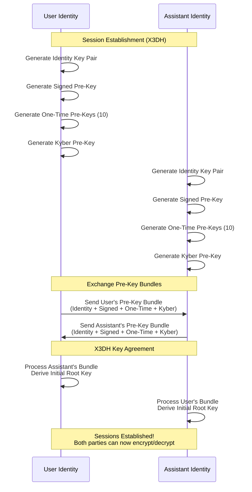
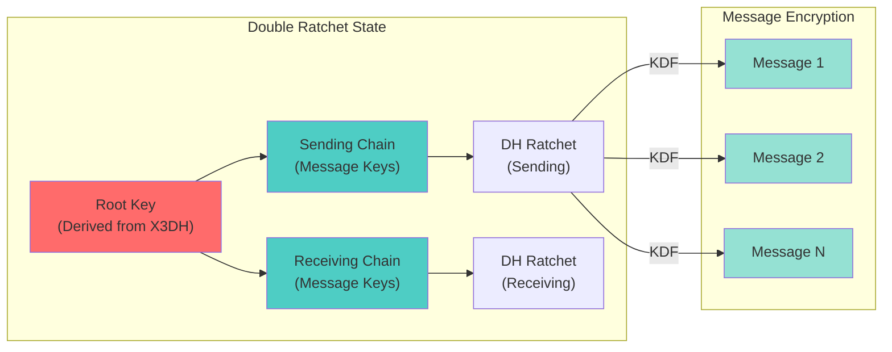
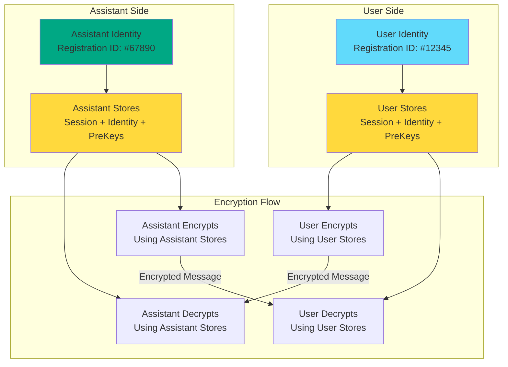
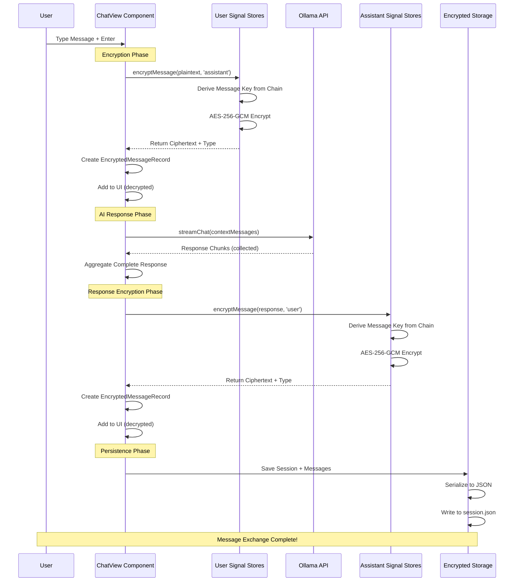
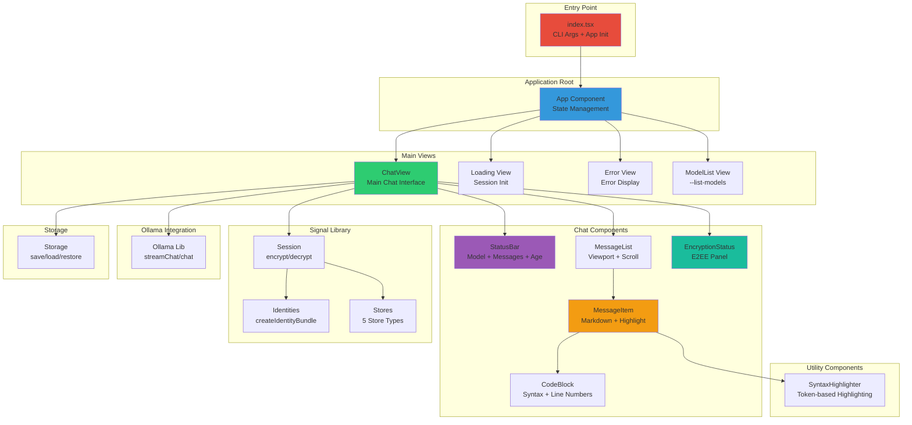
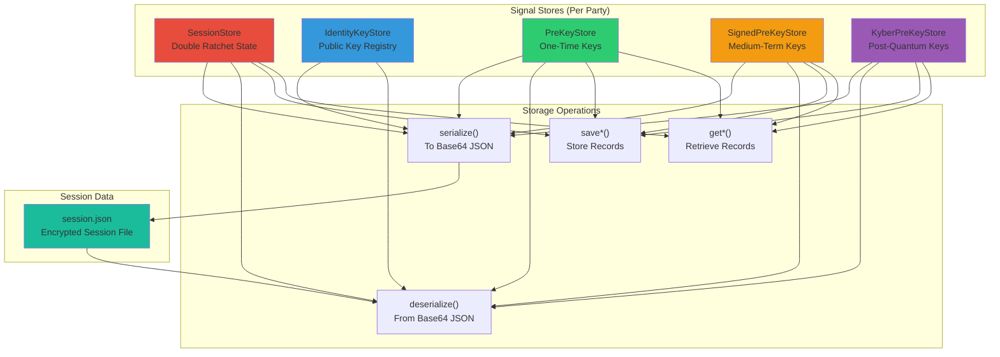

# Ollama Signal Chat

A Terminal User Interface (TUI) application for end-to-end encrypted chat with local Ollama AI models using the official Signal Protocol. This application provides a secure, privacy-focused chat experience with rich markdown rendering and syntax highlighting, all within your terminal.



## Table of Contents

- [Overview](#overview)
- [Key Features](#key-features)
- [System Architecture](#system-architecture)
- [Signal Protocol Implementation](#signal-protocol-implementation)
- [Message Flow](#message-flow)
- [Component Architecture](#component-architecture)
- [Store Architecture](#store-architecture)
- [Project Structure](#project-structure)
- [Prerequisites](#prerequisites)
- [Installation](#installation)
- [Usage](#usage)
- [Security Features](#security-features)
- [Development](#development)
- [Troubleshooting](#troubleshooting)

## Overview

Ollama Signal Chat combines the power of local LLM inference (via Ollama) with military-grade encryption (via the Signal Protocol). Unlike cloud-based chat solutions that store your conversations on external servers, this application:

- Runs entirely locally in Docker containers
- Encrypts all messages using the Signal Protocol (Double Ratchet algorithm)
- Never transmits your conversations to external services (except the local Ollama instance)
- Persists encrypted sessions locally with full user control

The application uses a unique two-party model where both the user and the AI assistant have separate Signal Protocol identities, enabling true bidirectional end-to-end encryption.



## Key Features

### Encryption & Security
- **End-to-End Encryption (E2EE)**: All messages encrypted using the official Signal Protocol
- **Double Ratchet Algorithm**: Provides forward secrecy and self-healing security
- **X3DH Key Agreement**: Extended Triple Diffie-Hellman for secure session establishment
- **Post-Quantum Security**: Kyber-1024 hybrid encryption protects against quantum computers
- **Perfect Forward Secrecy**: Compromised keys cannot decrypt past messages
- **Session Persistence**: Encrypted sessions saved locally with automatic restoration

### User Interface
- **Terminal User Interface (TUI)**: Rich interactive interface using Ink (React for terminals)
- **Markdown Rendering**: Full support for bold, italic, inline code, and code blocks
- **Syntax Highlighting**: Language-specific highlighting for 15+ programming languages
- **Responsive Layout**: Adapts to terminal width, shows encryption panel on wide screens
- **Simple Input**: Clean `>>>` prompt similar to `ollama run` CLI
- **Message History**: Scrollable conversation history with viewport optimization

### Integration
- **Ollama Integration**: Seamless connection to local Ollama instance
- **Model Support**: Works with any Ollama model (Llama, Qwen, Mistral, etc.)
- **Streaming Support**: Real-time response streaming (collected for display)
- **Docker Containerized**: Complete isolation with easy deployment
- **Network Host Mode**: Direct connection to Ollama in DistroBox or host

## System Architecture



### Architecture Components

1. **TUI Layer (Ink + React)**: Manages the terminal user interface, rendering components like message lists, input prompts, and status bars using React components rendered to the terminal via Ink.

2. **Signal Protocol Layer**: Implements the official Signal Protocol using `@signalapp/libsignal-client`. Manages identity keys, pre-keys, sessions, and encryption/decryption operations.

3. **Ollama Client**: Wraps the official Ollama JavaScript client to communicate with the local Ollama API for model inference and chat completions.

4. **Storage Layer**: Handles persistence of encrypted session data to JSON files, including identity bundles, session state, and message history.

5. **Signal Protocol Stack**: The cryptographic engine implementing X3DH for initial key exchange, Double Ratchet for message encryption, and Kyber for post-quantum security.

## Signal Protocol Implementation

The Signal Protocol is the gold standard for end-to-end encrypted messaging, used by billions of users worldwide through Signal, WhatsApp, and Facebook Messenger.

### X3DH (Extended Triple Diffie-Hellman)

X3DH establishes the initial shared secret between two parties using a combination of long-term and ephemeral keys.



**X3DH Key Components:**
- **Identity Key**: Long-term Curve25519 key pair (rarely changes)
- **Signed Pre-Key**: Medium-term key signed by identity key (rotated periodically)
- **One-Time Pre-Keys**: Ephemeral keys used once for forward secrecy
- **Kyber Pre-Key**: Post-quantum key encapsulation mechanism

### Double Ratchet Algorithm

After X3DH establishes the initial session, the Double Ratchet provides ongoing message encryption with automatic key rotation.



**How Double Ratchet Works:**
1. **Chain Keys**: Each message derives a unique message key from a chain key
2. **Key Rotation**: After each message, the chain key updates via KDF (Key Derivation Function)
3. **DH Ratchet**: Periodic Diffie-Hellman key exchanges between parties provide self-healing
4. **Forward Secrecy**: Each message uses a unique ephemeral key
5. **Break-in Recovery**: If keys are compromised, the ratchet heals over time

### Two-Party Identity Model

Unlike traditional Signal usage where each user has one identity and communicates with many others, this application uses a unique two-party model:



This architecture allows:
- **Bidirectional Encryption**: Both user and assistant can initiate encrypted messages
- **Symmetric Security**: Both parties have equal cryptographic capabilities
- **Independent Key Management**: Each party manages their own keys independently
- **Message Authenticity**: Each message is cryptographically signed by the sender

## Message Flow

The complete lifecycle of a message from user input to encrypted storage:



### Decryption Flow

When loading existing messages:

1. **Load Session**: Read `session.json` from disk
2. **Deserialize**: Restore identity bundles and store states
3. **Decrypt Each Message**:
   - Determine sender (user or assistant)
   - Use appropriate stores for decryption
   - Call Signal library decrypt function
   - Advance ratchet state
4. **Display**: Show decrypted content in message list

## Component Architecture

The TUI is built with React and Ink, using a component hierarchy that separates concerns:



### Component Responsibilities

| Component | Purpose | Key Features |
|-----------|---------|--------------|
| **index.tsx** | Entry point | CLI argument parsing, help text, app initialization |
| **App** | Root state management | Session initialization, error handling, view routing |
| **ChatView** | Main chat interface | Message flow, encryption/decryption, keyboard handling |
| **StatusBar** | Top information bar | Model name, message count, session age, shortcuts |
| **MessageList** | Scrollable message list | Viewport optimization, only shows recent messages |
| **MessageItem** | Individual message display | Markdown parsing, text wrapping, role-based styling |
| **CodeBlock** | Code display with highlighting | Line numbers, language label, bordered box, syntax colors |
| **EncryptionStatus** | Side panel (wide terminals) | E2EE status, protocol info, key store status |
| **SyntaxHighlighter** | Token-based highlighting | 15+ languages, keyword/string/number/function colors |

## Store Architecture

The Signal Protocol requires five specialized stores for different types of cryptographic state:



### Store Types

| Store | Purpose | Data Stored | Lifespan |
|-------|---------|-------------|----------|
| **SessionStore** | Double Ratchet state | Root keys, chain keys, message numbers | Per conversation |
| **IdentityKeyStore** | Identity management | Own private key, others' public keys | Long-term |
| **PreKeyStore** | One-time keys | Curve25519 key pairs (single-use) | Ephemeral |
| **SignedPreKeyStore** | Authenticated keys | Signed Curve25519 keys | Medium-term (1-4 weeks) |
| **KyberPreKeyStore** | Post-quantum keys | Kyber-1024 key pairs | Ephemeral |

### Serialization Flow

All stores implement `serialize()` and `deserialize()` methods for persistence:

1. **Runtime**: Stores hold cryptographic objects (KeyPairs, Records)
2. **Serialization**: Convert objects to base64-encoded strings
3. **Storage**: Save as JSON in `session.json`
4. **Deserialization**: Parse JSON, decode base64, reconstruct objects
5. **Restoration**: Populate store Maps with reconstructed data

## Project Structure

```
ollama-signal-chat/
├── src/
│   ├── index.tsx                    # CLI entry point, argument parsing
│   ├── app.tsx                      # Root component, session management
│   ├── types.ts                     # TypeScript interfaces and types
│   ├── components/
│   │   ├── chat-view.tsx            # Main chat interface
│   │   ├── message-list.tsx         # Scrollable message list
│   │   ├── message-item.tsx         # Individual message with markdown
│   │   ├── status-bar.tsx           # Top status bar
│   │   ├── encryption-status.tsx    # E2EE side panel
│   │   └── syntax-highlighter.tsx   # Token-based syntax highlighting
│   └── lib/
│       ├── ollama.ts                # Ollama API integration
│       ├── storage.ts               # Session persistence
│       └── signal/
│           ├── index.ts             # Re-exports
│           ├── types.ts             # Signal type definitions
│           ├── store.ts             # Store implementations
│           ├── identities.ts        # Identity bundle management
│           └── session.ts           # Encryption/decryption functions
├── data/                            # Session storage (Docker volume)
│   └── .gitkeep                     # Keep directory in git
├── Dockerfile                       # Container definition
├── docker-compose.yml               # Docker Compose configuration
├── entrypoint.sh                    # Container entry script
├── package.json                     # Dependencies
├── tsconfig.json                    # TypeScript configuration
└── .dockerignore                    # Docker build exclusions
```

## Prerequisites

Before installing, ensure you have:

1. **Docker** and **Docker Compose** installed
2. **Ollama** running locally (or in DistroBox with host networking)
3. At least one Ollama model pulled (e.g., `ollama pull llama3.2`)
4. **Bun** (for local development, not required for Docker usage)

### Installing Ollama

```bash
# Linux
curl -fsSL https://ollama.com/install.sh | sh

# macOS
brew install ollama

# Docker
docker run -d -v ollama:/root/.ollama -p 11434:11434 ollama/ollama
```

### Pulling Models

```bash
# Pull default model
ollama pull llama3.2

# Pull other models
ollama pull qwen2.5
ollama pull mistral
ollama pull codellama
```

## Installation

### Docker (Recommended)

```bash
# Clone repository
git clone <repository-url>
cd ollama-signal-chat

# Build Docker image
docker compose build

# Run with default model
docker compose run --rm -it chat

# Run with specific model
docker compose run --rm -it chat -m qwen2.5

# List available models
docker compose run --rm chat -l
```

### Local Development

```bash
# Install dependencies
bun install

# Run development server
bun run dev

# Run with specific model
bun run start --model qwen2.5

# Build for production
bun run build
```

## Usage

### Command-Line Interface

```
ollama-signal-chat - Encrypted TUI chat with Ollama using Signal Protocol

Usage:
  ollama-signal-chat [options]

Options:
  --reset, -r          Start a new encrypted session (clears history)
  --model, -m <name>   Specify the Ollama model to use (default: llama3.2)
  --list-models, -l    List available Ollama models
  --data-dir <path>    Directory for encrypted storage (default: /app/data)
  --help, -h           Show this help message

Environment Variables:
  OLLAMA_MODEL         Default model to use
  DATA_DIR             Default data directory

Examples:
  ollama-signal-chat                   # Start chat with default model
  ollama-signal-chat --model qwen2.5   # Use specific model
  ollama-signal-chat --reset           # Start fresh session
  ollama-signal-chat --list-models     # List available models
```

### Keyboard Shortcuts

| Key | Action |
|-----|--------|
| **Enter** | Submit message |
| **Backspace** | Delete character before cursor |
| **Left/Right Arrows** | Move cursor in input |
| **Ctrl+R** | Reset session (press twice to confirm) |
| **Escape** | Cancel reset confirmation |
| **Ctrl+C** | Exit application |

### Input Prompt

The application uses a simple `>>>` prompt similar to the native `ollama run` CLI:

```
Model: llama3.2 | Messages: 42 | Ctrl+R: Reset | Ctrl+C: Exit

You: Hello, how are you?

Assistant: I'm doing well, thank you for asking! How can I help you today?

>>> [cursor blinks here]
```

### Session Management

Sessions are automatically persisted to `/app/data/session.json` (inside Docker container, mapped to host volume). Each session includes:

- Encryption keys and state
- Message history (encrypted)
- Associated Ollama model
- Creation timestamp

To start a fresh session:
```bash
docker compose run --rm -it chat --reset
```

## Security Features

### Forward Secrecy

The Signal Protocol provides forward secrecy through:
- **One-time pre-keys**: Each initial handshake uses a unique ephemeral key
- **Chain keys**: Message keys are derived from chain keys that update after each message
- **Key deletion**: Old keys are securely discarded after use

**Result**: If long-term keys are compromised in the future, past messages remain secure because the ephemeral keys used to encrypt them have been destroyed.

### Future Secrecy (Self-Healing)

The Double Ratchet algorithm provides break-in recovery:
- **Automatic rotation**: Keys rotate automatically with each message
- **DH ratchet**: Periodic Diffie-Hellman exchanges heal compromised chains
- **Independent chains**: Sending and receiving chains are independent

**Result**: If current keys are compromised, the attacker can only decrypt a limited window of messages. Future messages use new keys derived from the ratchet.

### Post-Quantum Security

Kyber-1024 (NIST-standardized) provides quantum-resistant key encapsulation:
- **Hybrid approach**: Combines with classical Curve25519
- **Harvest protection**: Messages recorded today cannot be decrypted by future quantum computers
- **Dual security**: Both classical and post-quantum must be broken to compromise keys

### Local-Only Operation

Unlike cloud chat services:
- **No external transmission**: Conversations never leave your machine (except to local Ollama)
- **Encrypted at rest**: Session files are encrypted with Signal Protocol
- **User control**: You own and control all data
- **No telemetry**: No data collection or analytics

### Trust Model

This implementation uses "Trust on First Use" (TOFU):
- First session establishment is trusted without verification
- Subsequent sessions can detect key changes
- In production, consider adding safety number verification

## Development

### Project Setup

```bash
# Clone and setup
git clone <repository-url>
cd ollama-signal-chat
bun install

# Run in development mode (watch for changes)
bun run dev
```

### File Organization

```
src/
├── index.tsx           # Entry point
├── app.tsx             # Root component
├── types.ts            # Type definitions
├── components/         # UI components
│   ├── chat-view.tsx
│   ├── message-list.tsx
│   ├── message-item.tsx
│   ├── status-bar.tsx
│   ├── encryption-status.tsx
│   └── syntax-highlighter.tsx
└── lib/
    ├── ollama.ts       # Ollama integration
    ├── storage.ts      # Session persistence
    └── signal/         # Signal Protocol
        ├── index.ts
        ├── types.ts
        ├── store.ts
        ├── identities.ts
        └── session.ts
```

### Adding a New Component

1. Create file in `src/components/`
2. Export component function
3. Use Ink components (`Box`, `Text`, etc.)
4. Add to parent component
5. Update README architecture diagrams

### Testing Changes

```bash
# Rebuild Docker image after changes
docker compose build --no-cache

# Run and test
docker compose run --rm -it chat
```

### Code Style

- **TypeScript**: Strict mode enabled
- **Comments**: Comprehensive JSDoc for all functions
- **No emojis in source**: Only in documentation and UI text
- **Consistent formatting**: Follow existing patterns

## Troubleshooting

### Common Issues

#### Ollama Connection Failed

**Error**: `Failed to connect to Ollama`

**Solutions**:
```bash
# Check Ollama is running
curl http://localhost:11434/api/tags

# Start Ollama if not running
ollama serve

# Verify network mode in docker-compose.yml uses 'host'
```

#### Session Corruption

**Error**: `Session appears corrupted, clearing message history`

**Cause**: Incompatible code changes or file corruption

**Solution**: Reset the session:
```bash
docker compose run --rm -it chat --reset
```

#### Model Not Found

**Error**: `Model not found`

**Solution**: Pull the model first:
```bash
ollama pull llama3.2
```

#### Permission Denied (Docker)

**Error**: Cannot write to data directory

**Solution**: Check volume permissions:
```bash
# Check Docker volume
docker volume ls | grep ollama-chat-data

# Recreate if needed
docker volume rm ollama-chat-data
docker compose run --rm -it chat
```

#### Ink Rendering Errors

**Error**: `Text string must be rendered inside <Text> component`

**Cause**: Bare whitespace between Ink components

**Solution**: Ensure all text (including spaces) is wrapped in `<Text>`:
```tsx
// ❌ Bad
<Text>Model:</Text> <Text>{model}</Text>

// ✅ Good
<Text>Model:</Text>
<Text>{' '}{model}</Text>
```

### Debug Mode

Enable debug logging:
```bash
DEBUG=1 docker compose run --rm -it chat
```

### Getting Help

1. Check Ollama is running: `curl http://localhost:11434/api/tags`
2. Verify Docker network mode is `host` in `docker-compose.yml`
3. Check session file: `cat data/session.json | jq .`
4. Reset session: `docker compose run --rm -it chat --reset`
5. Rebuild: `docker compose build --no-cache`

---

## License

MIT License - See LICENSE file for details

## Acknowledgments

- **Signal Protocol**: Open Whisper Systems / Signal Messenger
- **Ollama**: Local LLM inference platform
- **Ink**: React for interactive command-line apps
- **Bun**: Fast JavaScript runtime

## Security Disclosure

If you discover a security vulnerability, please open an issue on the repository. Please do not disclose security issues publicly until they have been addressed.

---

*Built with 🔒 Signal Protocol, ⚡ Bun, and 🤖 Ollama*
